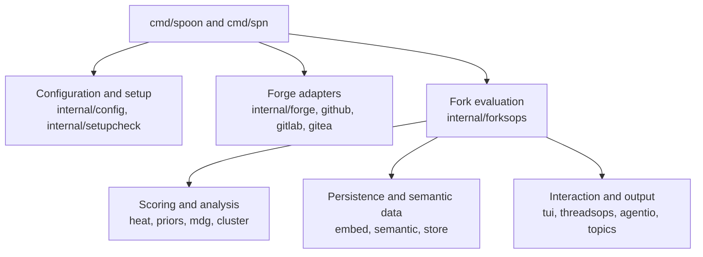
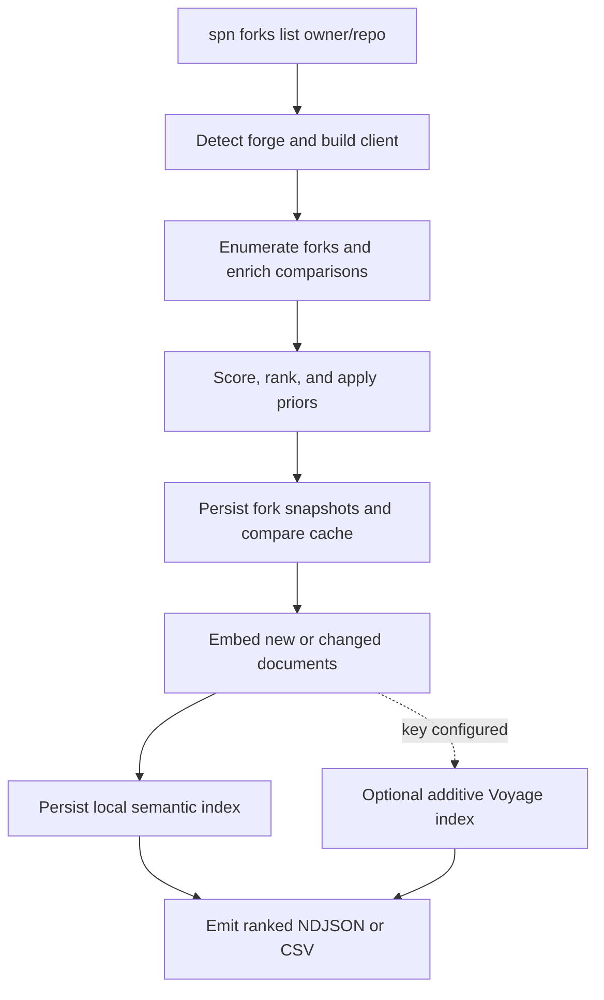
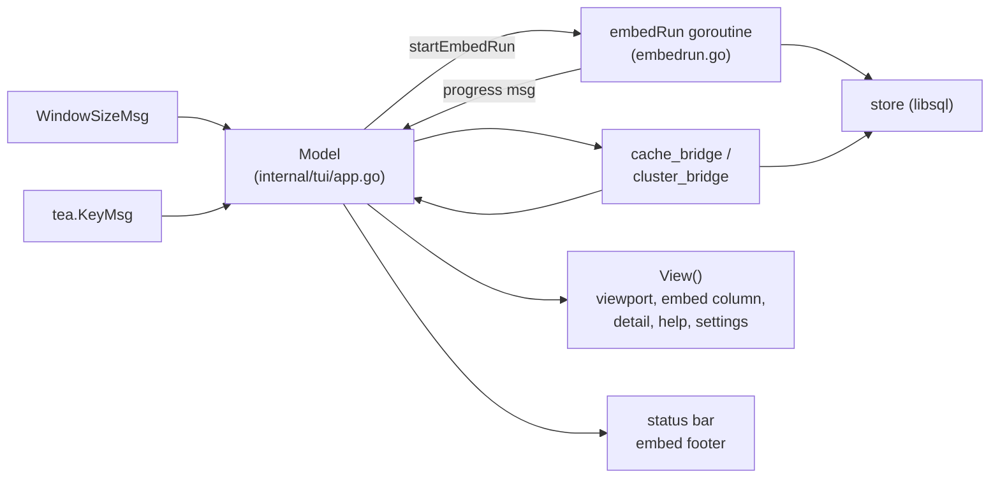

# spoon

Find useful forks of a Git repository.

`spoon` enumerates the forks of a GitHub or GitLab repo, enriches each with signals about activity and divergence (recency, stars, sub-forks, releases, ahead/behind counts, contributor mix), and ranks them so the interesting ones surface first. It works either as an interactive TUI or as JSON/CSV output for scripting.

## At a glance

- **Find differentiated forks:** combine recency, popularity, divergence, contributor, release, and change-shape signals instead of sorting by stars alone.
- **Choose the interface:** browse interactively with `spoon`, or stream deterministic JSON, NDJSON, and CSV from `spn`.
- **Search by intent:** rank forks against a query, apply curated path/language/owner priors, or search the persistent semantic index.
- **Work across forges:** GitHub, GitLab, self-hosted GitLab/GHES, and Gitea adapters share one evaluation pipeline.
- **Stay local by default:** lexical clustering needs no service; FastEmbed adds local semantic indexing when ONNX Runtime is available; Voyage is optional and additive.
- **Review pull requests:** inspect, reply to, apply suggestions from, and resolve GitHub review threads from the TUI or agent CLI.

| Binary | Use it for | Output |
| --- | --- | --- |
| `spoon` | Interactive fork discovery, topic picking, settings, and PR-thread review | Bubbletea TUI |
| `spn` | Agents, scripts, batch evaluation, semantic search, and machine-readable errors | JSON, NDJSON, or CSV |

## Build and quick start

Two binaries: `spoon` (interactive TUI) and `spn` (the agent-shaped
JSON/NDJSON CLI). Build both from a clone:

```sh
git clone https://github.com/Raudbjorn/spoon.git
cd spoon
go build -o spoon ./cmd/spoon      # interactive TUI
go build -o spn   ./cmd/spn        # agent CLI (JSON/NDJSON)
```

Requires Go 1.26.2+, matching the `go` directive in `go.mod`. The MDG centrality backend
(`--full-mdg`) uses tree-sitter parsers via cgo, so building also needs a
working C compiler on PATH (`gcc`/`clang` on Linux/macOS, MinGW or MSVC on
Windows). `CGO_ENABLED=1` is the Go default; do not unset it.

> **`go install …@latest` does not work.** The module path is
> `github.com/svnbjrn/spoon`, but no repository is published there — the code
> lives at [`github.com/Raudbjorn/spoon`](https://github.com/Raudbjorn/spoon).
> Until the module path is renamed to match, build from a clone as above.

## Auth

- **GitHub**: `gh auth login` (uses the `gh` CLI's stored token). For the
  round-robin dispatcher, add one or more PATs under `github.tokens` in the
  config file (mode `0600`) — see the rate-limit note below.
- **GitLab**: `glab auth login`, or set `GITLAB_TOKEN`

Unauthenticated requests work but hit much lower rate limits.

### Acquisition contract

GitHub REST calls pin `X-GitHub-Api-Version: 2022-11-28`. Fork lists are **direct children** by default; `--network-scope=all` is an opt-in bounded walk of the wider network. Cached fork lists are scoped to API version and credential identity so a broader login cannot be replayed as a narrower one. Private `/network/meta` and related undocumented routes are not used — see [docs/research/2026-08-19-spoon-endpoint-networking.md](docs/research/2026-08-19-spoon-endpoint-networking.md).


Optionally, set `VOYAGE_AI_API_KEY` to add [Voyage AI](https://docs.voyageai.com)
code embeddings and reranking on top of the local models — see
[Embedding, clustering & semantic search](#embedding-clustering--semantic-search).
It is the only external service spoon talks to, it is off by default, and
enabling it never changes what the local path does.

## Configuration

spoon is **zero-configuration**: the first run detects what the host offers
(gh/glab CLIs, token environment variables), writes a fully-populated default
config to `~/.config/spoon/config.json`, and drops a `README.md` beside it
documenting every field and `SPOON_*` environment variable. Everything is
enabled by default; edit the file or re-run `spoon setup` to change things.
Hosts without a home directory use `/etc/spoon/config.json` (which also serves
as an admin-provided defaults layer) and `/var/lib/spoon` for the store.
`SPOON_NO_CONFIG=1` ignores the config file entirely.

## Usage

```sh
spoon                                          # interactive (defaults to GitHub)
spoon golang/go                                 # GitHub repo
spoon gitlab.com/inkscape/inkscape              # GitLab (auto-detected)
spoon --forge gitlab group/repo                 # force provider
spoon --forge-host gitlab.example.com g/repo    # self-hosted GitLab
spn forks list charmbracelet/bubbletea          # NDJSON to stdout (agent CLI)
spn forks list charmbracelet/bubbletea --csv    # batched CSV (see "Agent CLI" below)
spn forks list golang/go --tier 1               # T1 only (skip compare calls)
spn forks list golang/go --top 5                # only enrich top 5 by T1 score
spn forks list pbakaus/impeccable --touching '**/registry/antipatterns.mjs'  # forks that changed a path
spoon topic:terminal                            # GitHub topic → repo picker → forks
```

Run `spoon --help` for the full flag list.

### TUI keybindings

The table below covers the main fork browser. The executable source of truth is
`internal/tui/keymap`; see [`docs/keymap.md`](docs/keymap.md) for every
context, prompt, settings action, and review-thread binding.

| Keys | Action |
| --- | --- |
| `↑`/`↓`, `j`/`k`, `PgUp`/`PgDn`, `Home`, `End`/`G` | Move or page through visible forks |
| `Enter` | Open fork details |
| `n` | Search a new repository |
| `/`, `Esc` | Apply a substring filter / clear the active filter |
| `R` | Rank forks by a free-text intent |
| `g` | Toggle cluster grouping |
| `s`, `S` | Cycle the sort column / reverse sort order |
| `o`, `d` | Open the selected fork / open its upstream comparison |
| `c` | Cycle the enrichment ceiling |
| `t`, `f` | Toggle the theme / hide or restore table chrome |
| `Space` | Mark or unmark a fork |
| `e`, `E` | Export marked / all forks |
| `i`, `I` | Embed marked / all forks |
| `,` | Open settings |
| `y`, `r` | Copy the clone command / refresh without cache |
| `?`, `q` | Open help / quit |

### PR review threads

The `spoon threads` subcommand lists, replies to, and resolves GitHub PR
review threads. It's the primary way an AI agent reasons about review
feedback.

```sh
spoon threads owner/repo#42                   # interactive TUI
spoon threads owner/repo#42 --json            # all unresolved threads as JSON
spoon threads owner/repo#42 --next            # one thread (or null) for agent loops
spoon threads owner/repo#42 --reply PRRT_… --body "fixed"
spoon threads owner/repo#42 --resolve PRRT_… --body "addressed in 1234abc"
spoon threads owner/repo#42 --resolve-all     # bulk close
spoon threads owner/repo#42 --unresolve-all   # inverse
```

Single-thread `--resolve` enforces a body when any commenter is a human
reviewer. `--resolve-all`/`--unresolve-all` are deliberate bulk
operations and accept no body.

Agent loop pattern:

```sh
while [ "$(spoon threads owner/repo#42 --next)" != "null" ]; do
  thread=$(spoon threads owner/repo#42 --next)
  # ... address the comment in code ...
  id=$(echo "$thread" | jq -r .id)
  spoon threads owner/repo#42 --resolve "$id" --body "addressed in $(git rev-parse --short HEAD)"
done
```

Every invocation prints a status header above its normal output: PR
title, mergeability (`CLEAN` / `DIRTY` / `BLOCKED` / …), review
decision (`APPROVED` / `REVIEW_REQUIRED` / …), check rollup
(`SUCCESS` / `FAILURE` / …), and unresolved thread count. If anything
in the header is red, resolving threads alone will not get the PR
merged — you have to fix the gate first. The header lands on stderr
for `--json` / `--next` so stdout stays pure JSON. Suppress with
`--no-status`.

## Agent CLI (`spn`)

`spn` is a sibling binary aimed at LLM/agent consumption. JSON-only, no
TUI, no color, structured error envelope with remediation hints, NDJSON
streaming for long-running queries.

`spn` is the second binary from [Build and quick start](#build-and-quick-start) above.

Verbs:

```sh
spn threads list <pr-ref> [--all] [--filter MODE]
spn threads next <pr-ref>
spn threads reply <pr-ref> <id> --body T
spn threads resolve <pr-ref> <id> [--body T] [--dry-run]
spn threads resolve-all <pr-ref> [--outdated] [--dry-run]
spn threads unresolve-all <pr-ref> [--dry-run]
spn threads apply-suggestion <pr-ref> <id> [--suggestion-index N] [--dry-run]
spn threads list-prs <owner/repo> [--limit N] [--state open]
spn pr status <pr-ref>
spn forks list <repo> [--tier N] [--top N] [--budget N] [--shortlist N]
    [--query "T"] [--priors PATH] [--touching PATH] [--files] [--commits]
    [--commit-files] [--cluster-top N] [--no-cluster] [--no-embed] [--csv] [...]
spn forks list topic:zig [--topic-repos 5] [...]
spn search "oauth rate limiting" [--repo owner/repo] [--top N] [--voyage]
spn forks eval <repo> --judgments FILE [--from-export EXPORT --rank-variant V]
spn repo centrality <owner/repo>
```

Run `spn --help` for the complete flag surface and mutation policy.

`spn forks list` writes every emitted fork snapshot to the global store at
`$XDG_CONFIG_HOME/spoon/spoon.db` (default `~/.config/spoon/spoon.db`;
`/var/lib/spoon/spoon.db` on hosts without a home directory) before printing
it. The store doubles as a cross-invocation cache shared with the TUI: a
stored compare is reused until its fork is pushed again. `--files` and
`--commits` opt into detailed wire output without changing what the store
retains. `--commit-files` implies both and attributes files to at most 100
commits per run by default; override with `--commit-file-budget N`.

GitHub traffic is capped at 300 requests/minute by default. Set `--rpm`,
`SPOON_GITHUB_RPM`, or `github.requestsPerMinute` (maximum 900). Configured
PATs are probed at startup and round-robin only across distinct GitHub
logins: several PATs for one login still share that user's 5,000-request/hour
primary budget and are deduplicated. REST and GraphQL primary budgets remain
separate. A config containing raw PATs or credential-file references must be
mode `0600`.

`--web-diff` is an explicitly unstable HTML fallback for missing REST patch
text. It reads a cookie only from `SPOON_GH_COOKIE`, never persists it, and is
not a supported GitHub API. REST metadata remains authoritative if the HTML
adapter fails.

Success: bare JSON to stdout. Failure: structured envelope to stderr:

```json
{"error": {"code": "policy_violation", "message": "...", "remediation": "spn threads resolve owner/repo#42 PRRT_... --body \"...\"", "retryable": false, "details": {...}}}
```

See [`docs/superpowers/specs/2026-05-10-spn-bifurcation-design.md`](docs/superpowers/specs/2026-05-10-spn-bifurcation-design.md) for the full design.

## Heat scoring

Forks are ranked by a 0–100 "heat" score built from additive tiers (T1
surface signals up to 40 pts, T2 divergence up to 40, T3 behavior up to 20):

- `recency` — exp-decay since last push, half-life adapted to upstream pace
- `stars` — independent star count (log-scaled)
- `sub_forks` — fork-of-fork activity
- `releases` — tagged releases
- `mna` — meaningful net additions (lines added beyond upstream)
- `sync_ratio` — how much of the divergence is the fork's own work
  (behind-counts are √-damped so forks of fast upstreams aren't drowned)
- `feature_ratio` — fraction of non-merge/non-sync commits
- `lone_wolf` — solo-developer signal (Sniper / Feature Builder / Drifter)
- `span` — duration of activity
- `novelty` — distance from the fork's cluster (set by the cluster pipeline)

The raw score is then finalized: a trust multiplier (stars/sub-fork
percentile within the fork set), a hard zero for forks with no commits
ahead, a 30-point cap for archived forks, and a dampener for
bottom-quintile recency. Repos with <10 forks score on the same tiers but
skip the percentile trust (too few samples).

Override component weights with `--heat-weights path/to/weights.json`
(each value in `[0.0, 2.0]`; works on both `spoon` and `spn forks list`).

## Curated priors (`--priors`)

Bias the ordering toward a subsystem you care about — without hiding any fork
or changing its heat. Pass a JSON interest spec to `spn forks list`:

```json
{
  "paths": ["internal/auth", "cmd/*.go"],
  "keywords": ["oauth", "rate limit"],
  "languages": ["Go", "Rust"],
  "owners": {"allow": ["torvalds"], "deny": ["fork-farmer"]}
}
```

```sh
spn forks list golang/go --priors interest.json
```

Each fork gains a `priorScore` (0–1) and `priorReasons` — e.g.
`path:internal/auth`, `keyword:oauth`, `language:go`, `owner_allow:torvalds`,
`owner_deny:fork-farmer` — computed from already-fetched data at zero extra API
cost. When neither `--query` nor `--shortlist` is active, matched forks are
listed before unmatched ones (heat order within each lane). Priors never hide a
fork or touch heat; a denied owner scores 0 but is still emitted, carrying its
`owner_deny` reason.

### Touched paths (`--touching`)

    spn forks list pbakaus/impeccable --touching '**/registry/antipatterns.mjs'

Reports only forks whose **own ahead commits** changed a matching path, with
the file's status and line counts under `touching.files`. Matching reads the
merge-base-relative compare (`base...head`) spoon already caches per fork, so
a fork that is merely behind upstream never matches, and a re-run against a
scanned network costs no API calls. Patterns are repo-relative; `**` spans
directories, `*` does not. Repeat the flag for several patterns.

Records carry `visibility.status: "pinned"` and `profile: "touches_target"`.
Each matched file also carries `centrality`, the upstream importance of its
directory (or module with `--full-mdg`) from the same backend that feeds
`changeImpact`; `touching.impact` is the highest of them and orders the
output, so a fork that edited a core module lists before one that edited docs.
`touching.partial: true` marks forks whose file list hit GitHub's 300-file
compare cap; an unmatched fork in that state is still printed so the gap is
visible. A stderr summary tallies matched / unmatched / unknown / never_pushed;
`unknown` forks were not compared (rate reserve) — re-run to backfill.
NDJSON only; `--csv` is rejected.

### Shortlist rank in the TUI

The `spoon` table carries the same model: the `P` column is each fork's
P-score as a percentage (`99` = beats almost every other fork, `50` = coin
flip), with a `~` prefix when the row is statistically tied with its
neighbour; `s` cycles to sort by it. The status bar shows `POTH` (precision
of the whole ordering) and `top10` (precision within the top ten); the detail
view lists expected rank, P-score, P(top 10) and the 95% rank interval; exports
carry a `rank` block per fork and a `rank_report`. Numbers are relative to the
strongest 200 forks and use the tier sigma (no `--eb` in the TUI).

### Shortlist rank summary

`--shortlist N` ranks the strongest 200 forks under a Gaussian utility model
(mu = heat, sigma from tier confidence) and emits the top N by Robbins
expected rank. Beside `expectedRank` and `rankConfidence`, each record carries
`pScore` (= SUCRA, `(n − expectedRank)/(n − 1)`), `pTopK` (P(rank ≤ N)),
`pFirst` (P(rank = 1)) and `rankLo`/`rankHi` (95% rank interval), computed
exactly from the pairwise win probabilities (Poisson-binomial). Treat `pTopK`
as the honest "does this fork belong here" number; wide-sigma tier-1 forks can
rank high with low `pTopK`. `tieBand` marks forks indistinguishable from a
neighbour in the emitted order. Full model and field reference:
[`docs/ranking.md`](docs/ranking.md).
`--shortlist-rule membership` selects by `pTopK` instead of expected rank (the
0/1-loss-optimal shortlist rule), then orders the selection by expected rank;
the default `expected` rule keeps the historical ordering.
Each shortlist run also emits a `rank_report` info envelope on stderr with the
pool size, how many ranked forks had heat > 0, and two precision-of-hierarchy
numbers (Wigle et al. 2025): `poth` over the pool and `cpothK` within the
shortlist — both in [0,1], 0 = every pair a coin flip. `--rank-diagnostics`
adds `pothResidual` per record (negative = this fork blurs the ordering; a
cheap trigger for a deeper fetch). `--csv` gains `expected_rank, p_score,
p_top_k, p_first, rank_lo, rank_hi` columns (empty without `--shortlist`).

### Empirical-Bayes shrinkage (`--eb`)

The tier sigma (7 / 3 / 1 heat points for tiers 1 / 2 / 3) is a constant, so
within a tier the rank machinery reduces to sorting by heat and the win
probabilities are not calibrated to any observed spread. `--eb` fits the
normal–normal hierarchical model over the ranked forks with heat > 0:
`τ̂²` by DerSimonian–Laird, then `θ̂ᵢ = m + Bᵢ(yᵢ − m)` with
`Bᵢ = τ̂²/(τ̂² + σᵢ²)` and posterior sd `1/√(σᵢ⁻² + τ̂⁻²)`. Ranking then uses
`θ̂`/posterior sd. Noisy tier-1 scores move toward the pool mean; confirmed
tier-3 scores barely move. Each record gains `ebTheta`, `ebSigma`,
`ebResidual` (standardised), `ebLeverage` (= B) and `ebFlag`
(residual² + leverage > 3, the TSD2 leverage-plot rule: a fork the model
does not explain). The `rank_report` gains `ebRegime` (`heterogeneous`,
`clamped`, `pooled` = τ̂ 0 so ranking left unchanged, `insufficient` = fewer
than 3 forks with heat > 0), `tauHat`, `ebMean`, `dBarOverK` (≈ 1 when the
model fits) and `pD`. `--prior-scale F` caps τ̂ at 2F (a half-normal prior on
τ with ≈5% mass above the cap); the default F is 1.4826 × MAD of the scores
and is printed in the report. Zero-heat forks are never shrunk. Off by
default until offline evaluation confirms it does not regress nDCG.

To compare ranking variants without network access, evaluate an export:

```bash
spn forks eval stablyai/orca --from-export spoon-export.json \
  --judgments judgments.json --rank-variant eb --shortlist 10
```

`--rank-variant` is one of `heat` (raw score), `erank` (expected rank, the
`--shortlist` default), `pscore`, `membership` (`--shortlist-rule membership`),
`eb` (`--eb`). Every variant is scored over the same top-200-by-heat rows, so
nDCG/AUC are comparable; the report carries `rankReport` and the ordered
`ranked` list with each fork's key. A seed judgment file for `stablyai/orca`
lives in `internal/eval/testdata/judgments_stablyai-orca_seed.json`; on it all
five variants tie (nDCG 0.967, AUC 0.85) because its labels were themselves
derived from a heat-ranked review — it proves non-regression, not gain.

Path matching (shared by `--priors`, `--touching`, and the TUI `path:` filter
via `internal/pathmatch`) is deliberately simple: a wildcard-free entry
matches by exact file or **directory prefix** (`internal/auth` covers
everything beneath it); an entry containing a glob without `**` uses
single-segment `path.Match` (`cmd/*.go` matches `cmd/main.go` but not
`cmd/sub/x.go`); a `**` segment matches zero or more whole path segments, so
`**/registry/antipatterns.mjs` matches at any depth.

## Fork profiles

Every `spn forks list` record also carries a `profile`: a deterministic,
one-word label derived only from fields already on the record (visibility,
lone-wolf archetype, momentum, penalties, priors). It is presentation-only —
never affecting scoring, ordering, or visibility — and exists purely to make
records easier to skim. First match wins, with `standard` as the floor:

| `profile` | when |
| --- | --- |
| `touches_target` | matches an explicit --touching path; overrides hidden/demoted for display only |
| `hidden` | upstreamed / no commits ahead (non-actionable) |
| `focused_change` | lone-wolf Sniper archetype |
| `focused_feature` | lone-wolf Feature Builder archetype |
| `broad_maintenance` | lone-wolf Drifter archetype |
| `emerging_active` | momentum rising or newly observed |
| `stale` | archived / low-recency penalty |
| `matches_priors` | matched a `--priors` spec (nothing higher fired) |
| `standard` | everything else |

A `profileReasons` array accompanies the label when it carries explanatory
facts (e.g. `archetype:feature_builder`, `momentum:rising`).

## Topic mode

Point spoon at a [GitHub topic](https://github.com/topics) instead of a
repo and it selects the repositories that best represent the topic —
scored by stars, fork-network size, and recency (archived repos are damped,
fork-less repos excluded; the selection breakdown is reported) — then runs
its normal fork evaluation over each.

- `spoon topic:NAME` shows the selection as a picker; Enter prospects the
  chosen repo's forks.
- `spn forks list topic:NAME` streams fork records for every selected repo,
  each tagged with an `upstream` field; selections are emitted as structured
  info envelopes on stderr. Cap the set with `--topic-repos N` (default 5).

## Embedding, clustering & semantic search

spoon's local embedder is **fastembed** — the fixed `fast-bge-small-en-v1.5` BGE
model (384 dimensions, max length 512) run in-process via native Go and ONNX
Runtime. It powers persistence, the semantic index (`spn search`), and — when
available — clustering plus the zero-shot `category` facet.

FastEmbed runs by **default** on every `spn forks list` (it is opt-out, not
opt-in):

- It needs ONNX Runtime. Set `ONNX_PATH=/path/to/libonnxruntime.so` and run
  `spoon setup` once — it downloads the model (cached under
  `$XDG_CACHE_HOME/spoon/models/fastembed`) and persists the config. The exact
  semantic identity is `fastembed:fast-bge-small-en-v1.5:maxlen=512:prompts=bge`.
- If ONNX Runtime is unavailable, the run **degrades gracefully**: it emits an
  `embed_unavailable` warning and continues without semantic indexing —
  listing, scoring, and clustering are unaffected.
- Pass `--no-embed` (or `SPOON_NO_EMBED=1`) to skip embedding entirely.

Clustering itself never requires a native runtime: when FastEmbed is active it
is used for clustering; otherwise clustering falls back to a **built-in
deterministic lexical embedder** over each fork's touched paths, commit
messages, README, and diff shape (zero setup). The interactive `spoon` TUI
always clusters with this lexical engine — semantic search and persistence live
in the `spn` agent CLI. Clusters get deterministic heuristic labels (dominant
directory prefix + the most discriminative commit/path tokens). Tune with
`--cluster-epsilon` / `--cluster-min-size`, cap the embedded set with
`--cluster-top`, or disable with `--no-cluster`.

`--query` relevance is scored over each fork's change digest — by the built-in
lexical scorer with no extra runtime, or by the Voyage cross-encoder when a key
is configured. In the TUI, `R` ranks the fork table the same way; it composes
with `/`, which filters by a substring of `owner/name`.

Each completed list run embeds only new or changed documents in batches of 32.
`spn search "<query>" --top 20` queries every indexed fork (or one upstream with
`--repo owner/repo`) and emits deterministic score-descending NDJSON. An empty
index is a successful empty result with a `semantic_index_empty` warning.

### Voyage AI (optional)

Setting `VOYAGE_AI_API_KEY` (or `VOYAGE_API_KEY`, or `embedder.voyage.apiKeyFile`
pointing at a 0600 file) adds Voyage's `voyage-code-3` embeddings and
`rerank-2.5` cross-encoder. It is **additive**: Voyage indexes each document
*alongside* fastembed rather than instead of it, so enabling or disabling it
never invalidates the local index, and clustering stays entirely local.

```sh
export VOYAGE_AI_API_KEY=...
spn forks list owner/repo               # indexes with fastembed AND voyage-code-3
spn search "oauth refresh" --voyage     # ranks against the Voyage index
spn search "oauth refresh"              # fastembed candidates, still reranked
spn search "oauth refresh" --no-rerank  # retrieval only
```

- `spn search` defaults to the fastembed index; `--voyage` selects the Voyage one
  and needs no ONNX Runtime. Every record carries `model`, so which index
  answered is visible.
- Reranking adds `rerankScore`/`rerankModel` while `score` stays the retrieval
  cosine. It works against either index, because a cross-encoder scores
  (query, document) pairs rather than vectors.
- Voyage is billed per token, so **nothing is paid for twice**: documents are
  embedded only when new or changed, and every request item is content-hash
  cached in `spoon.db`. Each run reports tokens billed, items served from cache
  and items deduplicated on stderr.
- Voyage stays **off** unless a key resolves *and* the store is writable — with
  nowhere durable to keep results, each run would re-buy answers it had to throw
  away.
- A Voyage failure is fatal only where you named Voyage on that invocation:
  `spn forks list` warns and continues on fastembed; `spn search --voyage`
  without a usable key exits 2 rather than quietly answering from a different
  model's index. `--no-voyage` / `SPOON_NO_VOYAGE=1` skips it entirely.

Full detail, including cost control and the degradation rules, is in
[docs/embedders.md](docs/embedders.md).


## Development

The normal local verification path builds both command entry points and runs
every package test:

```sh
go test ./...
go vet ./...
go build ./cmd/...
```

Tests live beside the package they exercise. Integration tests use the same
layout and keep external credentials, paid services, and native runtimes
opt-in. Long-form operational references live under `docs/`; development
designs and plans live under `docs/superpowers/`.

## Project layout

The repo is laid out as a small set of command entry points under `cmd/` and a
flat layer of cohesive packages under `internal/`. Every package owns its own
tests and is reusable from both the interactive `spoon` binary and the
JSON-shaped `spn` agent CLI — the two never fork behaviour, only shape.

```
cmd/
  spoon/           Interactive CLI entry point (TUI driver, `setup`, `threads`)
  spn/              Agent-shaped CLI (JSON/NDJSON only, no TUI, no color)

internal/
  forge/            Host abstraction (GitHub + GitLab + Gitea), detection, factory
  config/           Zero-config bootstrap, validated config file, env resolution
  github/           GitHub REST/GraphQL dispatcher, token/proxy pools, web-diff fallback
  gitlab/           GitLab REST client (forks, compare, contributors, auth)
  gitea/            Gitea client (auth, compare, contributors, provider)
  heat/             0-100 heat score, percentiles, filters, owner penalty, novelty
  mdg/              Module Dependency Graph centrality backend (opt-in, --full-mdg)
  priors/           JSON interest specs (--priors) computed from already-fetched data
  forksops/         Streaming fork enumeration, enrichment, ranking, secretary, profiles
  threadsops/       PR thread ops shared by `spoon threads` and `spn threads`
  agentio/          Structured error envelope + JSON writers for `spn`
  embed/            Fixed FastEmbed embedder, lexical fallback, Voyage adapter, status
  semantic/         Deterministic documents, vector codec, incremental indexing
  store/            Global libsql store: repo/fork/compare cache + embeddings
  cluster/          Clustering, novelty, heuristic labels, sibling search
  topics/           Topic-mode selection (best-of-topic scoring, picker UI)
  setupcheck/       Pre-flight detection (gh/glab CLIs, ONNX runtime, model cache)
  repo/             Shared repo-key derivation + cache helpers
  eval/             Embedding evaluation harnesses (HCA, momentum, schema)
  tui/              Bubbletea TUI (model, view, embed run, edit overlay, keymap)

docs/               Long-form reference (embedders.md, keymap.md, tui-components.md)
docs/superpowers/   Specs, plans, and skill metadata for the development workflow
scripts/            Build / packaging helpers
packaging/          Distribution recipes (Arch PKGBUILD, etc.)
experiments/        Scratchpads and abandoned branches kept for archaeology
vendor/             Vendored Go dependencies (matches go.mod / go.sum)
```

### Structural summary

Both binaries are thin entry points around the same pipeline. This intentionally
coarse map is the navigation aid; the directory tree above and the two flow
diagrams below provide the package-level detail.



### Data flow for one `spn forks list` run

The agent CLI follows a fixed, cache-aware pipeline. The store preserves
snapshots and vectors, so a repeated run skips comparisons and embeddings it
already covers.



### TUI composition

The Bubbletea model is intentionally a single `Update` loop; chrome,
paging, embed column, and detail overlay are computed by helper functions
that the same model calls. Embed and clustering data reach the view through
cache bridges that read from the store rather than holding in-memory copies
of the whole fork set.



### Test surface

Every package ships its own `*_test.go` files alongside the production
sources; integration tests live next to the package they exercise
(`fastembed_integration_test.go`, `threads_integration_test.go`, etc.). The
canonical commands live in the [Development](#development) section above.
